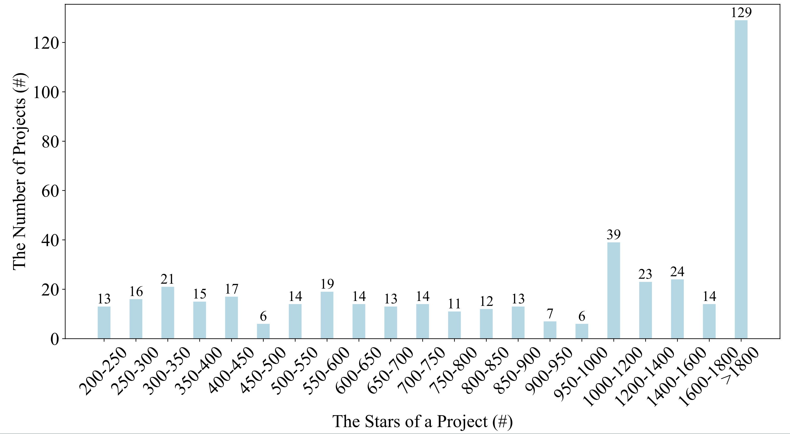

## libharmo

As a mixed result of intensive dependency on third-party libraries, flexible mechanisms to declare dependencies and increased number of modules in a project, different modules of a project directly depend on multiple versions of the same third-party library. Such library version inconsistencies could increase dependency maintenance cost, or even lead to dependency conflicts when modules are inter-dependent. Although automated build tools (e.g., Maven's enforcer plugin) provide partial support to detect library version inconsistencies, they do not provide any support to harmonize inconsistent library versions.

We first conduct a survey with 131 Java developers from GitHub to retrieve first-hand information about the root causes, detection methods, reasons for fixing or not fixing, fixing strategies, fixing efforts, and tool expectations on library version inconsistencies. Then, based on the insights from our survey, we propose LibHarmo, an interactive, effort-aware library version harmonization technique, to detect library version inconsistencies, interactively suggest a harmonized version with the least harmonization efforts based on library API usage analysis, and refactor build configuration files.

LibHarmo is currently developed for Java Maven projects. Our experimental study on 443 highly-starred Java Maven projects from GitHub shows that i) LibHarmo detected 621 library version inconsistencies in 152 (34.3%) projects with a false positive rate of 16.8%, while Maven's enforcer plugin only detected 219 of them; and ii) LibHarmo saved 87.5% of the harmonization efforts. Further, 16 library version inconsistencies have been confirmed, and 2 of them have been already harmonized by developers.

The paper has been submitted to ESEC/FSE 2020.    

This page lists the supplementary materiales that are omitted from the paper due to space limitations, provides the surveying questions of our study, and releases the code for tool.

### Survey

A Survey on Third-Party Library Version Inconsistency in Java

1. How many years of Java programming experience do you have?
   * Less than 5 years
   * 5 to 10 years
   * more than 10 years
3. How many modules in a Java project did you participate in?
   * Less than 5 modules
   * 5 to 10 modules
   * more than 10 modules
5. Have you ever encountered library version inconsistency?
   * Yes
   * No
4. Is library version inconsistency a problem during project maintenance?
   - Yes
   - No
5. What are the root causes of library version inconsistency?
   * Unawareness of the library version inconsistency problem
   * Not regarding library version inconsistency as a problem
   * Unawareness of the same library in other modules
   * Different development schedule in different modules
   * Backward incompatibility issues in library versions
   * Others, please specify __
6. How did you detect library version inconsistency?
   * Bugs due to library API behavior changes
   * Bugs due to conflicting library versions (i.e., when multiple versions of a library exist in a module, JVM will load one of them and shadow the others)
   * Communication with developers of other modules
   * Investigation of module POMs
   * Others, please specify ______
7. What are the reasons of not fixing library version inconsistencies?
   * Heavy fixing efforts due to backward incompatibility issues
   * Heavy fixing efforts due to intensive library dependency
   * Fixing difficulty due to different development schedule in different modules
   * No serious consequence occurred
   * Others, please specify ______
8. What are the reasons of fixing library version inconsistencies?
   * Serious consequence (e.g., bugs) occurred
   * Ensuring consistent behaviors of library APIs across modules
   * Avoiding great maintenance efforts in the long run
   * Others, please specify ______
9. Which version do you use as the harmonized version to fix library version inconsistencies?
   * One of the declared versions with least fixing efforts
   * One of the higher versions than all declared versions with least fixing efforts
   * Others, please specify ______
10. How do you fix library version inconsistencies?
   * Fix some of the affected modules
   * Fix all of the affected modules
11. How much time do you spend in fixing library version inconsistencies?
    * Minutes
    * Hours
    * Days
    * Others, please specify ______
12. Which part of it is most time-consuming in fixing library inconsistency?
    * Locating all inconsistent versions
    * Determining the harmonized version
    * Refactoring the POM files
    * Refactoring the source code
    * Others, please specify ______
13. Is an automatic library version harmonization tool useful for library management?
    * Yes, because ______
    * No, because ______
    * It depends because ______
14. Which of the following features would be useful for an automatic library version harmonization tool?
    * Detect library version inconsistencies
    * Suggest the harmonized version
    * Report detailed API-level fixing efforts
    * Refactor the POM files
    * Refactor the source code
    * Others, please specify ______

### Code

You can download source code from [here](code.zip).

### Report

A report automatically generated for project [vladmihalcea flexy-pool](vladmihalcea flexy-pool.pdf) that contains one library inconsistency.

A report automatically generated for project [Stratio cassandra-lucene-index](Stratio cassandra-lucene-index.pdf) that contains two library false consistencies.

### Project Statistics

Detailed project statistics about domain category, lines of code, number of commits and number of stars are available  [here](projects.csv).

